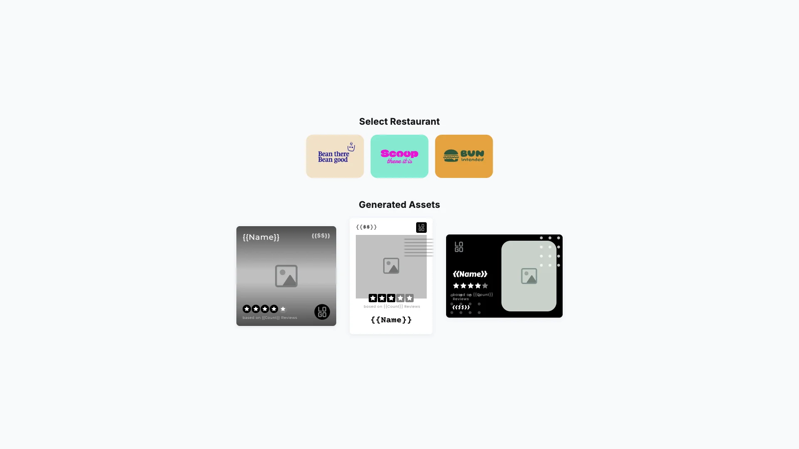

# Multi-Image Generation Starter Kit

Generate branded images at scale using CE.SDK — batch-produce social media graphics, promotional materials, and marketing assets from templates. Built with [CE.SDK](https://img.ly/creative-sdk) by [IMG.LY](https://img.ly), runs entirely in the browser with no server dependencies.

<p>
  <a href="https://img.ly/docs/cesdk/starterkits/multi-image-generation/">Documentation</a> |
  <a href="https://img.ly/showcases/cesdk">Live Demo</a>
</p>



## Getting Started

### Clone the Repository

```bash
git clone https://github.com/imgly/starterkit-multi-image-generation-ts-web.git
cd starterkit-multi-image-generation-ts-web
```

### Install Dependencies

```bash
npm install
```

### Download Assets

CE.SDK requires engine assets (fonts, icons, UI elements) served from your `public/` directory.

```bash
curl -O https://cdn.img.ly/packages/imgly/cesdk-js/$UBQ_VERSION$/imgly-assets.zip
unzip imgly-assets.zip -d public/
rm imgly-assets.zip
```

### Run the Development Server

```bash
npm run dev
```

Open `http://localhost:5173` in your browser.

## Configuration

### Loading Content

Load content into the editor using one of these methods:

```typescript
// Create a blank design canvas
await cesdk.createDesignScene();

// Load from a template archive
await cesdk.loadFromArchiveURL('https://example.com/template.zip');

// Load from a scene file
await cesdk.loadFromURL('https://example.com/scene.json');

// Load from an image
await cesdk.createFromImage('https://example.com/image.jpg');
```

See [Open the Editor](https://img.ly/docs/cesdk/web/guides/open-editor/) for all loading methods.

### Theming

```typescript
cesdk.ui.setTheme('dark'); // 'light' | 'dark' | 'system'
```

See [Theming](https://img.ly/docs/cesdk/web/ui-styling/theming/) for custom color schemes and styling.

### Localization

```typescript
cesdk.i18n.setTranslations({
  de: { 'common.save': 'Speichern' }
});
cesdk.i18n.setLocale('de');
```

See [Localization](https://img.ly/docs/cesdk/web/ui-styling/localization/) for supported languages and translation keys.

## Architecture

```
starterkit-multi-image-generation-ts-web/
├── src/
│   ├── index.tsx                 # Application entry point
│   ├── scenes.json               # Scene templates configuration
│   ├── app/                      # React application components
│   │   ├── App.tsx               # Main app with generation flow
│   │   ├── EditorModal/          # Editor modal component
│   │   ├── AssetGrid/            # Generated assets display
│   │   └── RestaurantSelector/   # Data source selection
│   └── imgly/
│       ├── index.ts              # Module exports
│       ├── generation.ts         # Batch generation utilities
│       └── config/
│           ├── design-editor/        # Adopter mode config
│           └── advanced-design-editor/ # Creator mode config
├── public/                       # Static assets
├── package.json
└── vite.config.ts
```

## Key Capabilities

- **Batch Generation** – Generate multiple images from templates automatically
- **Template Variables** – Dynamic content replacement with brand data
- **Dual Editor Modes** – Adopter mode for simple editing, Creator mode for advanced design
- **Brand Colors** – Automatic color application across generated assets
- **Multi-Format Export** – PNG, JPEG output with quality controls

## Prerequisites

- **Node.js v20+** with npm – [Download](https://nodejs.org/)
- **Supported browsers** – Chrome 114+, Edge 114+, Firefox 115+, Safari 15.6+

## Troubleshooting

| Issue | Solution |
|-------|----------|
| Editor doesn't load | Verify assets are accessible at `baseURL` |
| Assets don't appear | Check `public/assets/` directory exists |
| Watermark appears | Add your license key |

## Documentation

For complete integration guides and API reference, visit the [Multi-Image Generation Documentation](https://img.ly/docs/cesdk/starterkits/multi-image-generation/).

## License

This project is licensed under the MIT License - see the [LICENSE](LICENSE) file for details.

---

<p align="center">Built with <a href="https://img.ly/creative-sdk?utm_source=github&utm_medium=project&utm_campaign=starterkit-multi-image-generation">CE.SDK</a> by <a href="https://img.ly?utm_source=github&utm_medium=project&utm_campaign=starterkit-multi-image-generation">IMG.LY</a></p>
